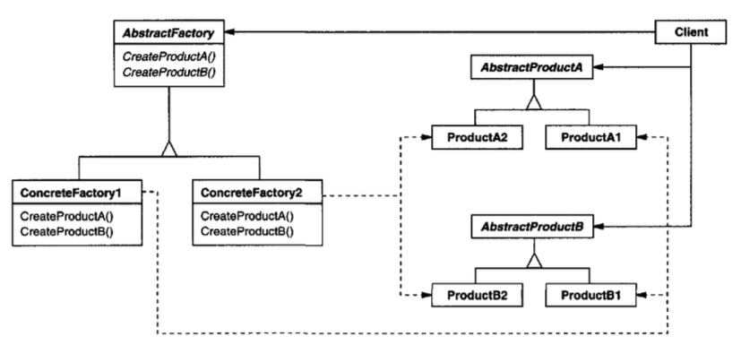

# Abstract Factory Pattern

- 서로 관련있거나 의존적인 여러 객체 그룹을 생성하기 위한 인터페이스를 제공하는 패0턴입니다.

## 추상 팩토리 패턴과 팩토리 메서드 패턴의 차이점

- 추상 팩토리 패턴은 관련된 객체 그룹을 생성하기 위한 인터페이스를 제공하는 패턴으로, 여러 종류의 객체를 생성하고자 할 때 사용됩니다.
- 팩토리 메서드 패턴은 객체 생성을 서브 클래스에 위임하여 실행 시점에 인스턴스의 타입이 결정되도록 하는 패턴으로, 단일 객체를 생성하고자 할 때 주로 사용됩니다.

두 패턴은 객체 생성과 관련하여 다른 목적과 사용 시나리오를 가지고 있습니다.

## 역할

### AbstractFactory(추상 팩토리) 역할

- 관련된 객체 그룹을 생성하기 위한 인터페이스를 결정합니다.
- 예시에서는 Factory 인터페이스가 이 역할을 합니다.

### ConcreteFactory(구체적인 팩토리) 역할

- AbstractFactory 역할을 구현합니다.
- 예시에서는 IPhoneFactory와 AndroidFactory 클래스가 이 역할을 합니다.

### AbstractProduct(추상 제품) 역할

- 패턴으로 생성되는 인스턴스가 가져야 할 인터페이스를 결정합니다.
- 예시에서는 Phone, OS 인터페이스가 이 역할을 합니다.

### ConcreteProduct(구체적인 제품) 역할

- AbstractProduct 역할을 구현합니다.
- 예시에서는 IPhone, Android 클래스가 이 역할을 합니다.