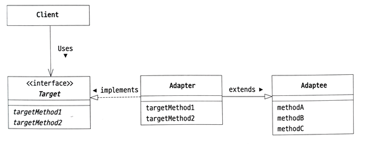
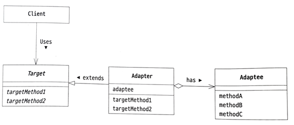

# Adapter Pattern

- 서로 다른 인터페이스를 가진 클래스들이 함께 작동할 수 있도록 해줍니다.
- 가정용 전원에서 제공되는 교류 100볼트를 노트북 사용을 위한 직류 12볼트로 변환해주는 전원 어댑터와 유사하게, 어댑터 패턴은 기존 코드나 라이브러리의 인터페이스를 요구 사항에 맞게 변환해주는 역할을 합니다.
- 이미 제공된 코드를 그대로 사용할 수 없을 때 필요한 형태로 변환한 후 사용할 수 있도록 하는 패턴입니다.
- 무엇인가를 포장해서 다른 용도로 사용할 수 있도록 변환해 주다보니 Wrapper 패턴이라고도 불립니다.

## 종류

- 클래스에 의한 어댑터 패턴 (상속을 이용한 어댑터 패턴)
- 인스턴스에 의한 어댑터 패턴 (위임을 이용한 어댑터 패턴)

## 역할

### Target(대상) 역할

- 노트북을 작동시키는데 필요한 직류 12볼트에 해당합니다.
- 예시에서는 StringAdderA 인터페이스, StringAdderB 추상 클래스가 이 역할을 합니다.

### Client(의뢰자) 역할

- Target 메소드를 사용해 일을 처리합니다.
- 직류 12볼트로 작동하는 노트북에 해당합니다.
- 예시에서는 Main 클래스가 이 역할을 합니다.

### Adaptee(적응 대상자) 역할

- 가정용 전원에서 제공되는 교류 100볼트에 해당합니다.
- 이미 준비된 메소드를 가지는 클래스에 해당합니다.
- 예시에서는 IntegerAdder 클래스가 이 역할을 합니다.

### Adapter(어댑터) 역할

- 교류 100볼트를 직류 12볼트로 변환하는 어댑터에 해당합니다.
- Adaptee의 메소드를 사용해 어떻게든 Target을 만족시키는 일을 처리합니다.
- 예시에서는 AdderAdapterA 클래스, AdderAdapterB 클래스가 이 역할을 합니다.

## 사용 시나리오

어댑터 패턴은 다음과 같은 상황에서 유용합니다:

- 기존의 작동하는 클래스를 재사용하고자 하지만, 그 인터페이스가 현재 프로젝트에서 요구하는 인터페이스와 맞지 않을 때.
- 상속보다는 위임을 통해 유연성을 유지하면서도, 기존 코드의 기능을 확장하거나 수정 없이 사용하고자 할 때.

### 어댑터 패턴을 사용하지 않고 직접 변환하면 안될까?

어댑터 패턴을 사용하는 대신 직접 변환 코드를 작성하는 접근 방식은 특정 상황에서 더 간단하고 직관적일 수 있습니다. 
그러나 어댑터 패턴을 사용함으로써 얻을 수 있는 주요 장점들도 있습니다

**직접 변환 코드 작성의 장점**

- 간단성: 변환 로직이 단순하고 한 곳에서만 사용될 때, 코드가 더 직관적이고 간결할 수 있습니다.
- 직접 제어: 변환 과정을 완전히 제어하고, 필요한 경우 즉시 수정할 수 있습니다.

**어댑터 패턴 사용의 장점**

- 재사용성: 변환 로직을 어댑터 클래스로 분리함으로써, 다양한 컨텍스트에서 해당 로직을 재사용할 수 있습니다.
- 확장성: 어댑터를 통해 기존 클래스의 기능에 추가적인 기능을 더 쉽게 추가할 수 있습니다(예: 로깅, 캐싱).
- 결합도 감소: 어댑터 패턴은 기존 클래스와 클라이언트 코드 사이의 결합도를 낮춰 시스템의 유연성을 향상시킵니다.
- 인터페이스 분리: 클라이언트는 필요한 기능만을 노출시킨 어댑터를 통해 기존 클래스를 사용하므로, 클라이언트 코드가 더 단순하고 이해하기 쉬워집니다.

변환 로직이 매우 단순하고 한 번만 사용되는 경우, 패턴 없이 직접 변환 코드를 작성하는 것이 더 적합할 수 있습니다. 그러나 코드의 재사용성과 유지 보수를 중시한다면 어댑터 패턴을 사용하는 것이 좋습니다.

### 상속과 위임 중 어떤 방법을 사용하는 것이 좋은가?

- 일반적으로 위임을 사용하는 것이 좋습니다.
- 상속은 상위 클래스의 내부 동작을 자세히 모르면 효과적으로 사용하기 어렵기 때문입니다.