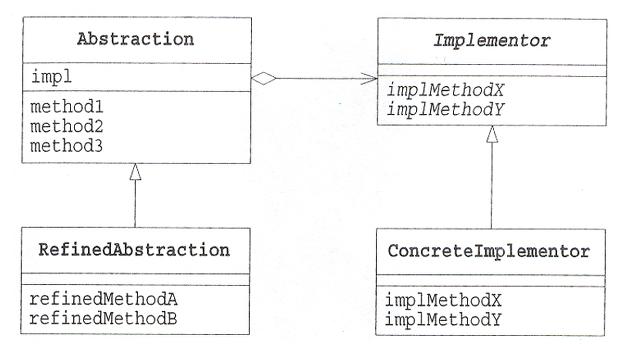

# Bridge Pattern

- 브릿지 패턴은 기능과 구현을 분리하는 디자인 패턴입니다. 
- 기능은 추상화 클래스로 정의되며, 구현은 인터페이스로 정의됩니다.
- 어떤 기능을 수행할 것인지와 그 기능을 어떻게 구현할 것인지를 분리하여 시스템을 보다 유연하게 만드는 패턴입니다.

브릿지 패턴을 사용하여 기능과 구현을 분리하면 각각의 클래스 계층을 독립적으로 확장할 수 있는 것이 장점입니다.

## 기능의 클래스 계층

클래스에 새로운 기능을 추가하고 싶을 때 하위 클래스(자식, 파생, 확장)로 새로운 기능을 추가하는 방법이 있습니다. 
이때 상위 클래스와 하위 클래스 간에 계층이 생기게 됩니다. 이 계층을 기능의 클래스 계층이라고 부릅니다.

- 상위 클래스는 기본적인 기능을 가지고 있습니다.
- 하위 클래스에서 새로운 기능을 추가합니다.

```java
Something
    └── SomethingA // Something에서 새로운 기능 추가
            └── SomethingB // SomethingA에서 새로운 기능 추가
```

## 구현의 클래스 계층

추상 클래스와 이를 구현하는 클래스 간에 계층이 생기게 됩니다. 이 계층을 구현의 클래스 계층이라고 부릅니다.

- 상위 클래스는 추상 메소드로 인터페이스를 규정합니다.
- 하위 클래스는 추상 메소드를 구현하여 인터페이스를 구현합니다.

```java
AbstractClass 
    └── ConcreteClass // AbstractClass를 구현1
    └── ConcreteClass // AbstractClass를 구현2
```

## 역할

### Abstraction(추상화) 역할

- 기능의 클래스 계층의 최상위 클래스입니다.
- Implementor 역할의 메소드를 사용하여 기능을 구현합니다.
- 예시에서는 Display 클래스가 이 역할을 합니다.

### RefinedAbstraction(개선된 추상화) 역할

- Abstraction 역할에 대해 기능을 추가한 역할입니다.
- 예시에서는 CountDisplay 클래스가 이 역할을 합니다.

### Implementor(구현자) 역할

- 구현의 클래스 계층의 최상위 클래스입니다.
- Abstraction 역할의 인터페이스(API)를 구현하기 위한 메소드를 규정합니다.
- 예시에서는 DisplayImpl 클래스가 이 역할을 합니다.

### ConcreteImplementor(구체적인 구현자) 역할

- Implementor 역할의 인터페이스(API)를 구체적으로 구현하는 역할입니다.
- 예시에서는 StringDisplayImpl, HtmlDisplayImpl 클래스가 이 역할을 합니다.

