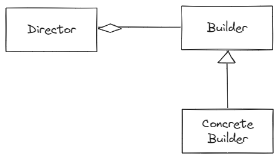

# Builder Pattern

## Gof에서 소개된 Director를 사용한 빌더 패턴

- 객체의 생성 과정과 표현 방법을 분리하여 복잡한 객체를 생성하는 패턴입니다.
- 동일한 생성 절차에서 서로 다른 표현 결과를 만들 수 있습니다.

## 역할

### Builder(건축자) 역할

- 복잡한 객체를 생성하기 위한 인터페이스(API)를 결정합니다.
- 예시에서는 Builder 인터페이스가 이 역할을 합니다.

### ConcreteBuilder(구체적인 건축자) 역할

- Builder 인터페이스를 구현하는 클래스 입니다.
- 예시에서는 TextBuilder와 HTMLBuilder 클래스가 이 역할을 합니다.

### Director(감독자) 역할

- Builder에서 제공하는 메서드들을 사용해서 인스턴스를 생성합니다.
- 예시에서는 Director 클래스가 이 역할을 합니다.

## 이펙티브 자바에서 소개된 빌더 패턴

- 객체 생성시 많은 매개변수를 요구할 때(특히, 선택적 매개변수가 많을 때) 사용하기 적합한 패턴입니다.

### 장점

1. 매개변수가 많은 개체를 생성할 때 필요한 매개변수만 선택할 수 있으며 가독성이 좋습니다.
2. 필수 멤버를 빌더 생성자의 매개변수로 넣고, 선택적 멤버는 빌더 패턴을 사용하여 객체를 생성할 수 있습니다.
3. 초기화 검증 과정을 멤버별로 분리할 수 있습니다.
4. 객체 생성 단계를 주도적으로 지연할 수 있으며 불변성을 보장할 수 있습니다.

### 단점

1. 생성자보다 성능이 떨어집니다.
2. 빌더 패턴의 코드가 길어질 수록 가독성이 떨어집니다.

## Gof 빌더 패턴과 이펙티브 자바 빌더 패턴의 차이점

Gof에서 소개된 디렉터를 사용한 빌더 패턴은 여러가지의 빌드 형식을 유연하게 처리하는 것에 목적을 둡니다. 

그러나 이펙티브 자바에서 소개된 빌더 패턴은 하나의 대상 객체에 대한 생성을 목적으로 둡니다.

즉, 두 패턴은 서로 다른 목적과 사용 방식을 갖고 있습니다.
