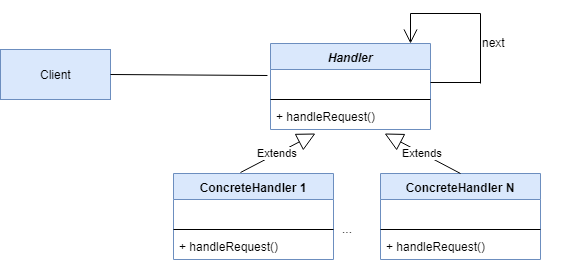

# Chain of Responsibility(책임 연쇄 패턴)

- 여러 객체를 사슬(chain)처럼 연쇄적으로 묶고, 객체 사슬을 차례대로 돌면서 원하는 객체를 결정하는 패턴입니다.
- 어떤 요청이 있을 때 그 요청을 처리할 객체를 고정적으로 결정할 수 없는 경우에 사용합니다.
- 고객은 첫번째 사람에게 해결해달라고 요구만 하면 사슬 안으로 흘러가다가 적절한 처리자에 의해 처리됩니다. 그러나 만약 이 패턴을 사용하지 않았다면 고객은 어떤 사람에게 요구해야 할지 알아야 합니다.

## 역할

### Handler(처리자)

- 요청을 처리하는 인터페이스를 정의합니다. 
- 처리할 다음 사람을 준비해 두고 스스로 처리할 수 없으면 다음 사람에게 넘깁니다.
- 예시에서는 Support가 이 역할을 합니다.

### ConcreteHandler(구체적인 처리자)

- 실제로 요청을 처리하는 역할을 합니다.
- 예시에서는 NoSupport, NormalSupport, ... 등이 이 역할을 합니다.

