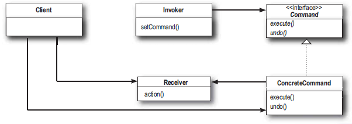

# Command Pattern

- 요청을 객체의 형태로 캡슐화하여 사용자가 요청을 발생시키는 호출자(Invoker)와 요청을 수행하는 수신자(Receiver) 사이의 의존성을 줄이는 데 목적이 있는 패턴입니다.
- 호출자는 수신자의 구체적인 구현을 알 필요 없이 명령을 실행할 수 있으며, 명령을 변경하거나 새로운 명령을 추가하는 것도 용이해져 유연성과 재사용성이 향상됩니다.

## 역할

### Command(명령) 역할

- 명령을 실행하기 위한 인터페이스를 결정합니다.
- 예시에서는 `Command` 인터페이스가 이 역할을 합니다.

### ConcreteCommand(구체적인 명령) 역할

- 실제로 명령을 실행하는 클래스입니다. 
- ConcreteCommand는 명령 객체가 수행할 작업을 캡슐화함으로써, 발신자(호출자, Invoker)와 수신자(Receiver) 사이의 직접적인 의존성을 제거합니다.
- 예시에서는 Lamp를 켜는 명령을 캡슐화하는 `LampOnCommand`, Alarm을 울리는 명령을 캡슐화하는 `AlarmOnCommand`가 이 역할을 합니다.

### Invoker(호출자) 역할

- 명령을 실행하는 역할입니다.
- Command에 정의된 execute 메소드를 호출하여 명령을 실행합니다.
- 예시에서는 `Button`이 이 역할을 합니다.

### Receiver(수신자) 역할

- 명령을 실행할 때 대상이 됩니다.
- 예시에서는 `Lamp`와 `Alarm`이 이 역할을 합니다.

### Client(의뢰자) 역할

- ConcreteCommand 역할을 생성하고, Receiver를 할당하고 Invoker에게 ConcreteCommand를 전달합니다.
- 예시에서는 `Main`이 이 역할을 합니다.

