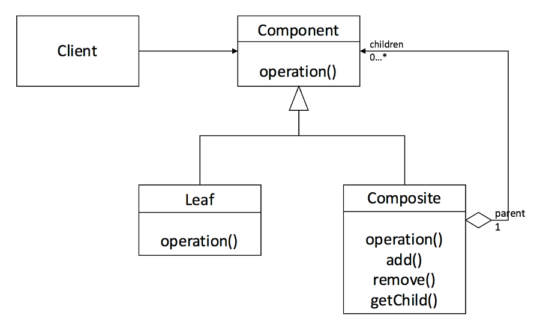

# Composite Pattern(컴포지트 패턴)

- 그룹 전체와 개별 객체를 동일하게 처리할 수 있는 패턴입니다.
- 그릇 안에 내용물도 넣을 수 있고 작은 그릇도 넣을 수 있듯이 그릇과 내용물을 동일시하여 재귀적인 구조를 만드는 것입니다.

## 역할

### Leaf(잎) 역할

- 내용물을 나타내는 역할입니다.
- 이 안에는 다른 것을 넣을 수 없습니다.
- 예시에서는 File이 이 역할을 합니다.

### Composite(복합체) 역할

- 그릇을 나타내는 역할입니다.
- Leaf와 Composite 역할을 넣을 수 있습니다.
- 예시에서는 Directory가 이 역할을 합니다.

### Component(요소) 역할

- Leaf와 Composite 역할을 동일시하기 위한 역할입니다.
- Leaf와 Composite 역할에 공통되는 상위 클래스로 구현됩니다.
- 예시에서는 Entry가 이 역할을 합니다.

