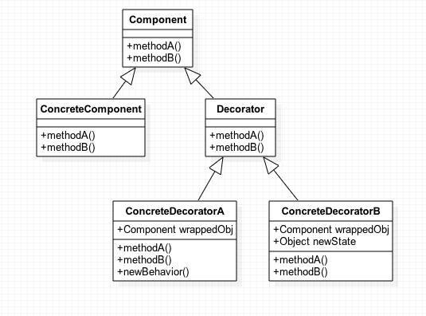

# Decorator Pattern

- 코드를 변경하지 않고 프록시를 도입해서 부가 기능을 추가하는 패턴입니다.
- 실제 객체가 있고 이를 데코레이터로 감싸서 부가 기능을 추가합니다.
- 객체에 추가 책임(기능)을 동적으로 추가하고 기능 확장을 위한 유연한 대안을 제공합니다.

## 사용 목적

데코레이터 패턴은 객체에 동적으로 새로운 책임을 추가할 수 있는 유연성을 제공합니다. 

기존 코드를 변경하지 않고도 객체의 기능을 확장할 수 있어, 기능 추가와 관련된 복잡성과 클래스 수의 증가 문제를 해결할 수 있습니다.

### 사용 예시

케이크에 다양한 장식을 추가하는 상황을 생각해보면, 각각의 장식을 개별적인 데코레이터 객체로 구현할 수 있습니다. 

크림, 과일, 초콜릿 소스, 캔디 각각을 데코레이터로 만들고, 이들을 조합하여 다양한 케이크를 생성할 수 있습니다. 

만약 모든 순서와 조합을 고려한 클래스를 만들어야 한다면, 4! = 24개의 클래스가 필요하지만, 데코레이터 패턴을 사용하면 4개의 데코레이터 클래스만 있으면 됩니다.

## 역할

### Component

- 기능을 추가할 때 핵심이 되는 역할입니다.
- 예시에서는 `Component` 인터페이스가 이 역할을 합니다.

### ConcreteComponent

- Component 역할의 구현체로, 기본이 되는 기능을 가지고 있는 클래스입니다.
- 예시에서는 `RealComponent`가 이 역할을 합니다.

### Decorator

- Component 역할과 동일한 인터페이스를 가지며, 데코레이터 역할을 하는 클래스입니다.
- 예시에서는 `Decorator` 추상 클래스가 이 역할을 합니다.

### ConcreteDecorator

- Decorator 역할의 구현체로, 실제로 기능을 추가하는 클래스입니다.
- 예시에서는 `MessageDecorator`, `TimeDecorator`가 이 역할을 합니다.

## 기타

### 프록시

클라이언트(요청하는 객체)가 직접 서버(요청을 처리하는 객체)에 요청하는 것이 아닌 대리자를 통해 간접적으로 요청할 수 있는 데 이때 대리자를 프록시(Proxy)라고 합니다.

GOF 디자인 패턴에서는 프록시를 사용하는 방식이지만 의도에 따라 프록시 패턴과 데코레이터 패턴으로 구분합니다.

- 프록시 패턴: 접근 제어가 목적
- 데코레이터 패턴: 새로운 기능 추가가 목적

예시에서는 BaseCake가 서버 역할, CakeDecorator가 프록시 역할을 하고 DI를 사용해 클라이언트 코드의 변경 없이 유연하게 프록시를 주입할 수 있습니다.
