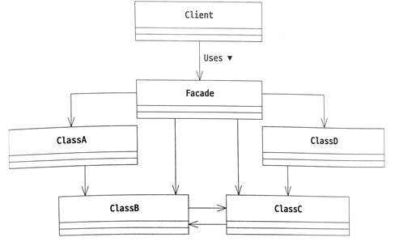

# Facade Pattern

- 일련의 저수준 인터페이스들을 하나의 고수준 인터페이스로 묶어주는 패턴입니다.
- 클라이언트가 여러 저수준의 인터페이스의 동작을 제어하려면 일일이 호출해야 하는데, 파사드 패턴을 이용하면 고수준 인터페이스 메서드 호출만으로 한번에 해결할 수 있습니다.

## 역할

### Facade(정면)

- 클라이언트가 사용할 기능을 제공하는 고수준 인터페이스입니다.
- 파사드 인터페이스는 클라이언트의 요청을 처리하기 위해 하나 이상의 저수준 인터페이스를 호출합니다.
- 예시에서는 Facade 클래스가 이 역할을 합니다.

### 시스템을 구성하는 그 밖의 많은 배역

- Facade 인터페이스가 호출하는 저수준 인터페이스입니다.
- 각자의 역할을 수행하고 Facade에 대해서는 알지 못합니다.
- 예시에서는 Beverage, Movie, RemoteControl 클래스가 이 역할을 합니다.

