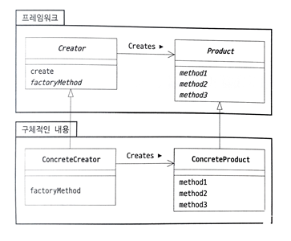

# Factory Method Pattern

- 객체 생성을 위한 인터페이스를 정의하되, 인스턴스를 만들 클래스의 결정은 서브클래스가 하도록 하는 패턴입니다.
- 객체 생성을 위한 인터페이스를 제공하면서도, 실제 생성할 객체의 타입은 서브클래스에서 결정하게 함으로써 객체 생성 과정의 유연성을 높입니다.

## Simple Factory Pattern (단순 팩토리 패턴)

- 객체를 생성하는 클래스를 따로 두는 패턴입니다.
- 객체를 만드는 모든 작업을 하나의 팩토리 클래스에 모아 두는 것을 의미합니다.
- 클라이언트는 생성하고자 하는 객체의 구체적인 클래스에 대해 알 필요 없이, 팩토리 클래스를 통해 필요한 객체를 얻을 수 있습니다.

## Factory Method Pattern (팩토리 메서드 패턴)

- 단순 팩토리 패턴에서 팩토리 클래스를 상속한 서브클래스에서 객체 생성을 담당하도록 한 패턴입니다.
- 단순 팩토리 예시에서 createPhone 부분을 추상 메소드로 만들어, 상속한 서브클래스에서 구현한 것입니다.

## 역할

### Product(제품) 역할

- 패턴으로 생성되는 인스턴스가 가져야 할 인터페이스를 정의합니다.
- 예시에서는 Phone 인터페이스가 이 역할을 합니다.

### Creator(생성자) 역할

- Proudct를 생성하는 추상 클래스입니다.
- 예시에서는 Factory 클래스가 이 역할을 합니다.

### ConcreteProduct(구체적인 제품) 역할

- Product를 실제로 구현한 클래스입니다.
- 예시에서는 IPhone과 Android 클래스가 이 역할을 합니다.

### ConcreteCreator(구체적인 생성자) 역할

- 실제로 인스턴스를 생성하는 클래스입니다.
- 예시에서는 IPhoneFactory와 AndroidFactory 클래스가 이 역할을 합니다.



## 기타

### static 팩토리 메소드

- 인스턴스 생성을 위한 클래스 메소드(static 메소드)를 팩토리 메소드라고 부르는 경우가 있습니다.
- GoF의 팩토리 메소드 패턴과는 다르지만 Java에서 인스턴스를 생성할 때 매우 자주 사용되는 기법입니다.
- create, getInstance, newInstance 등의 이름을 가진 메소드가 이에 해당합니다.

```java
// getInstance 메소드는 난수 생성 알고리즘 이름을 정해서 SecureRandom 인스턴스를 생성하는 static 팩토리 메소드입니다.
SecureRandom random = SecureRandom.getInstance("SHA1PRNG");

// List.of 메소드는 인수로 전달된 요소를 원소로 하는 List 인스턴스를 생성하는 static 팩토리 메소드입니다.
List<String> list = List.of("A", "B", "C");

// String.valueOf 메소드는 다양한 문자열 표현을 얻는 static 팩토리 메소드입니다.
String str = String.valueOf('A');

// Instant.now 메소드는 현재 시각을 나타내는 Instant 인스턴스를 생성하는 static 팩토리 메소드입니다.
Instant now = Instant.now();
```


