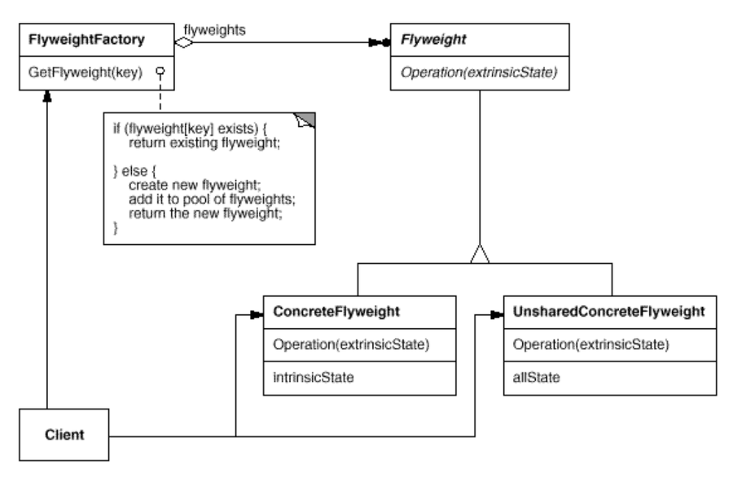

# Flyweight Pattern

- 재사용 가능한 객체 인스턴스를 공유시켜 메모리 사용량을 최소화하는 패턴입니다. (메모리를 적게 사용하는 객체를 가벼운 객체라고 합니다.)
- 캐시(Cache) 개념을 코드로 패턴화 한것으로 자주 변화는 속성(extrinsit)과 변하지 않는 속성(intrinsit)을 분리하고 변하지 않는 속성을 캐시하여 재사용해 메모리 사용을 줄이는 방식입니다.

## 역할

### Flyweight(경량) 역할

- 공유 가능하여 재사용 되는 객체 (intrinsic state)
- 예시에서는 TreeModel이 이 역할을 합니다.

### FlyweightFactory(경량 팩토리) 역할

- Flyweight 역할을 생성하고 관리하는 역할 입니다.
- 캐시 역할을 수행합니다.
- 예시에서는 TreeModelFactory가 이 역할을 합니다.

## 기타

### HashMap 사용시 주의사항

예시에서 HashMap을 사용해 캐싱을 구현했는데 이렇게 관리하고 있는 인스턴스는 GC(Garbage Collection) 처리되지 않는다는 점을 주의해야 합니다.

나무 렌더링을 완료하고 더이상 나무를 생성할 일이 없다면 cache를 비워줘야 인스턴스에 대한 참조를 잃은 TreeModel 인스턴스들이 GC에 의해 메모리 청소가 됩니다. 만약 비워 주지 않으면 메모리에 쓸데없이 잔존하게 됩니다.

## 출처

### flyweight 패턴 코드 예시 

[경량(Flyweight) 패턴 - 완벽 마스터하기](https://inpa.tistory.com/entry/GOF-%F0%9F%92%A0-Flyweight-%ED%8C%A8%ED%84%B4-%EC%A0%9C%EB%8C%80%EB%A1%9C-%EB%B0%B0%EC%9B%8C%EB%B3%B4%EC%9E%90)
