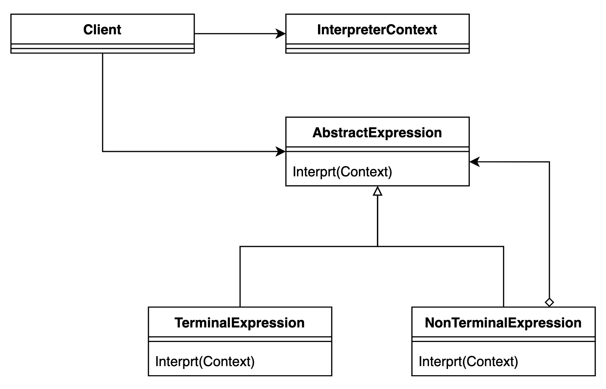

# Interpreter Pattern

- 문법적 규칙을 클래스화 하여, 일련의 규칙을 통해 언어/문법을 해석하는 패턴입니다. (주어진 언어에 대한 인터프리터를 구현하는 패턴이라고도 할 수 있습니다.)
- 특정 문제를 해결하기 위해 정의된 미니 언어의 문법을 구현하고, 해당 언어로 작성된 문장을 해석하여 실행할 수 있는 인터프리터를 제공합니다.
- 주어진 문제에 대한 해결 방법이 변경될 경우, 인터프리터 자체를 수정하는 대신, 미니 프로그램의 코드를 변경함으로써 새로운 요구 사항에 대응할 수 있는 유연성을 제공합니다.

## 역할

### AbstractExpression(추상 표현식)

- 모든 표현식의 공통 인터페이스를 정의합니다.
- 인터프리터에 정의된 문법 규칙을 해석하기 위한 interpret() 메서드를 정의합니다.
- 예시에서는 `Expression` 인터페이스가 해당 역할을 수행합니다.

### TerminalExpression(단말 표현식)

- 문법의 기본 요소를 나타내는 표현식입니다.
- 터미널 표현식은 더 이상 분해되거나 해석될 수 없는 최소 단위의 표현식입니다. (더이상 내부 구성 요소를 가지지 않습니다.)
- 숫자나 기본 문자등이 여기에 해당합니다.
- 예시에서는 `Number` 클래스가 해당 역할을 수행합니다.

### NonterminalExpression(비단말 표현식)

- 다른 AbstractExpression 객체들을 조합하여 복잡한 규칙을 나타내는 표현식입니다.
- 일반적으로 두 개 이상의 AbstractExpression 객체들을 내부에 가지고 있어, 이들의 interpret 메서드를 조합하여 실행합니다.
- 예시에서는 `Plus`, `Minus` 클래스가 해당 역할을 수행합니다.

### Context(컨텍스트)

- 인터프리터가 해석할 문장을 저장하고 있는 클래스입니다.
- 해석 과정에 필요한 추가 정보(변수 할당, 연산 상태, 환경 설정 등)를 관리하고 전달하기 위해 사용됩니다.
- 예시에서는 `Context` 클래스가 해당 역할을 수행합니다.

