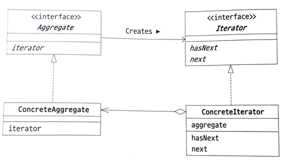

# Iterator Pattern

이터레이터 패턴은 집합체의 내부 구조에 상관없이, 집합체을 순회할 수 있는 일반화된 방법을 제공하는 디자인 패턴입니다. 

이를 통해 배열, 리스트, 트리, 그래프 등 다양한 집합체를 동일한 인터페이스로 순회할 수 있게 됩니다. 이터레이터 패턴은 크게 네 가지 역할로 구분됩니다:


## 역할

### Aggregate(집합체) 역할

- Iterable<E> 인터페이스
- 집합체 역할은 Iterator 역할의 인스턴스를 생성하는 메소드를 제공합니다.

```java
public interface Iterable<E> {
    Iterator<E> iterator();
}
```

### ConcreteAggregate(구체적인 집합체) 역할

- Aggregate의 인터페이스를 구현하여 Iterator 인스턴스를 생성하는 클래스입니다.
- 예시에서는 FoodList 클래스가 이 역할을 합니다.

### Iterator(반복자) 역할

- Iterator<E> 인터페이스
- 집합체의 요소를 순차적으로 접근하기 위한 인터페이스를 정의합니다. 
- hasNext() 메소드는 다음 요소가 있는지 확인하고, next() 메소드는 다음 요소에 접근합니다.

```java
public interface Iterator<E> {
    boolean hasNext();
    E next();
}
```

### ConcreteIterator(구체적인 반복자) 역할

- Iterator 인터페이스를 구현하여 집합체의 요소를 순회하는 로직을 구현합니다.
- 예시에서는 FoodListIterator 클래스가 이 역할을 합니다.



## 질문

### 왜 이터레이터 패턴을 사용해야 할까요?

이터레이터 패턴을 사용하면, 컬렉션의 내부 구조와 상관없이, 그 컬렉션을 순회할 수 있는 일반화된 방법을 제공합니다. 

즉, 클라이언트는 집합체의 내부 구조를 알 필요가 없습니다. (구현과 분리하여 반복이 가능합니다.)