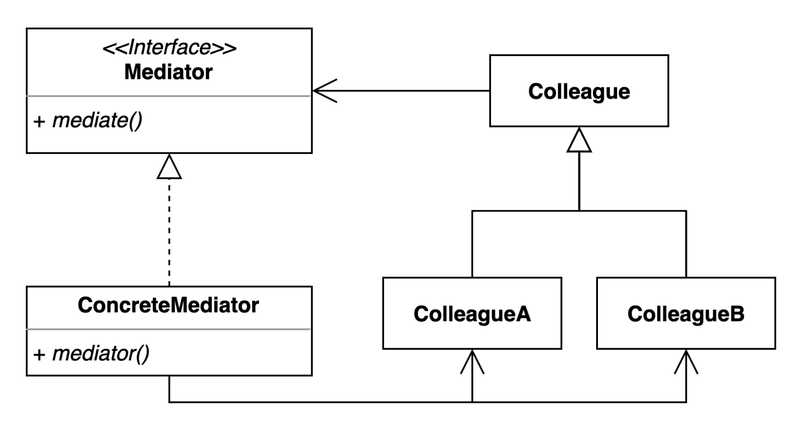

# Mediator Pattern (중재자 패턴)

- 객체 간의 복잡한 통신을 단순화하기 위해 사용되는 패턴입니다. 
- 모든 객체 간의 직접적인 상호작용을 줄이고, 대신 중재자 객체를 통해 통신합니다. 중재자는 객체들 사이의 상호작용을 중앙에서 조정하고 관리합니다. 
- 이를 통해 각 객체는 다른 객체들과의 직접적인 연결 없이도 메시지를 주고받을 수 있습니다.

## 사용 이유

### 결합도 감소

- 객체들이 서로 직접 통신하지 않고 중재자를 통해 통신하기 때문에, 객체 간의 결합도가 낮아집니다. 
- 이는 각 객체의 독립성을 증가시키고, 시스템의 유연성을 향상시킵니다.

### 유지보수성 향상

- 통신 로직이 중재자에 집중되어 있기 때문에, 객체 간의 상호작용을 변경하거나 확장하기가 더 쉽습니다.
- 특정 객체를 수정하거나 추가할 때, 다른 객체들에 미치는 영향이 적고, 중재자만 업데이트하면 됩니다.

### 재사용성 증가

- 특정 상황이나 애플리케이션에 특화된 통신 로직을 가진 중재자를 개발하여 재사용할 수 있습니다.

### 복잡성 관리

- 대규모 시스템에서 많은 객체들이 서로 복잡하게 상호작용할 때, 중재자 패턴을 사용하면 이러한 복잡성을 관리할 수 있습니다. 
- 중재자가 통신의 복잡성을 캡슐화하므로, 개발자는 보다 단순한 인터페이스에 집중할 수 있습니다.

## 역할

### Mediator(중재자)

- 객체들 사이의 상호작용을 중앙에서 조정하고 관리하는 인터페이스를 정의합니다.
- 예시에서는 Mediator 인터페이스가 이 역할을 합니다.

### ConcreteMediator(구체적인 중재자)

- 중재자 인터페이스를 구현합니다.
- 예시에서는 ConcreteMediator 클래스가 이 역할을 합니다.

### Colleague(동료)

- 중재자를 통해 통신하는 객체들의 인터페이스를 정의합니다.
- 예시에서는 User 추상 클래스가 이 역할을 합니다.

### ConcreteColleague(구체적인 동료)

- 동료 인터페이스를 구현합니다.
- 예시에서는 ConcreteUser 클래스가 이 역할을 합니다.

