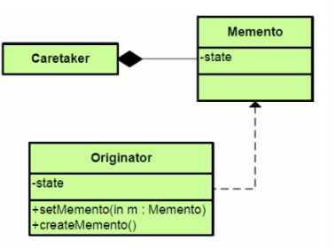

# Memento Pattern

- 메멘토 패턴은 객체의 상태를 이전 상태로 복원할 수 있는 패턴입니다.
- 객체 내부 상태를 외부에 직접 노출시키지 않으면서 상태 정보를 관리하고 접근할 수 있습니다. (캡슐화)
- 예시로는 텍스트를 지우더라도 이전 상태로 복원할 수 있는 실행취소(undo)기능이 있습니다. 

## 역할

### Originator(원본 객체) 역

- 자신의 현재 상태를 저장하거나 이전 시점의 상태로 되돌리는 역할입니다.
- 예시에서는 `TextEditor`가 해당 역할을 합니다.

### Memento(메멘토) 역할

- 상태를 저장하는 역할을 하고 나중에 복원할 수 있도록 합니다.
- Originator(TextEditor)에서만 Menento에 접근할 수 있습니다.
- 예시에서는 `Memento`가 해당 역할을 합니다.

두가지 인터페이스를 구별해 사용함으로써 캡슐화 방지를 막을 수 있습니다.

- **narrow interface(좁은)** : Caretaker가 사용할 수 있도록 제공되며, 메멘토의 상태를 변경하거나 조회하는 기능을 제공하지 않습니다.
- **wide interface(넓은)** : Originator에 의해서만 사용됩니다. Originator는 자신의 상태를 저장하거나 복원할 때 메멘토의 내부 상태에 접근할 수 있는 권한을 가집니다.

### Caretaker(관리자) 역할

- 관리자는 Memento 객체들의 기록을 관리합니다.
- 예시에서는 `Caretaker`가 해당 역할을 합니다.

## 기타

### Caretaker와 Originator의 역할을 나눌 필요가 있을까?

- Caretaker는 어느 시점에 스냅샷을 찍을지, 언제 실행 취소를 할지를 결정하고 Memento를 저장하는 역할을 합니다.
- Originator는 Memento를 생성하고 주어진 Memento를 사용하여 자신의 상태를 되돌리는 일을 합니다.

이렇게 서로 역할을 분담한다면 하나에 수정이 생겨도 다른 역할에 영향을 미치지 않기 때문입니다.
