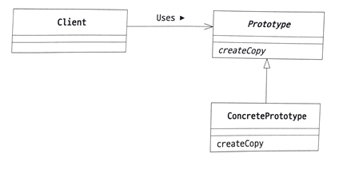

# Prototype Pattern

- 클래스로부터 인스턴스를 만드는 대신 인스턴스를 복사해서 새로운 인스턴스를 만드는 패턴입니다.
- new와 클래스 이름이 아닌 이미 생성된 객체를 통해서 독립된 또다른 객체를 생성합니다.
- Prototype으로 만든 객체는 상태를 변경해도 원본 객체에 영향을 주지 않습니다. (Deep Copy, 깊은 복사)

## 사용 이유

1. 효율성: 객체를 처음부터 생성하는 것보다 기존 객체를 복제하는 것이 더 효율적일 수 있습니다. 특히 초기화 과정이 복잡하거나 리소스를 많이 소모할 때 이 방법이 유리합니다.
2. 유연성: 프로토타입 패턴을 사용하면 실행 시간(runtime)에 새로운 객체 타입을 동적으로 추가하고 복제할 수 있어 유연성이 증가합니다. 즉, 어떤 클래스의 인스턴스를 만들지 코드 상에서 미리 결정하지 않고 실행 중에 결정할 수 있습니다.
3. 객체 상태의 보존: 복제를 통해 생성된 객체는 원본 객체의 상태를 그대로 가집니다. 따라서 특정 상태를 가진 객체를 여러 번 사용해야 할 때 유용합니다.

## 역할

### Prototype(원형) 역할

- 인스턴스를 복사하여 새로운 인스턴스를 만들기 위한 메소드를 결정합니다.
- 예시에서는 Product 인터페이스가 이 역할을 합니다.

### ConcretePrototype(구체적인 원형) 역할

- 인스턴스를 복사하여 새로운 인스턴스를 만드는 메소드를 실제로 구현합니다.
- 예시에서는 MessageBox와 UnderlinePen이 이 역할을 합니다.

### Client(이용자) 역할

- 인스턴스를 복사하는 메소드를 이용해 새로운 인스턴스를 만듭니다.
- 예시에서는 Manager가 이 역할을 합니다.

## 기타

### Cloneable

- 자바에서는 Cloneable 인터페이스를 구현해야만 clone() 메소드를 사용할 수 있습니다.
- clone 메소드는 Object 클래스에 정의되어 있습니다. 
- Cloneable 인터페이스에는 메소드가 하나도 선언되어있지 않습니다. 따라서 Cloneable 인터페이스는 단순히 clone 메소드로 복제를 허용한다는 의도적인 표시로 사용되는데 이런 표시를 하는 인터페이스를 마커 인터페이스(marker interface)라고 합니다.
- clone은 얕은 복사를 하기 때문에, 객체 내부에 참조하는 객체가 있을 경우, 참조하는 객체까지 복사하려면 clone 메소드를 오버라이드하여 깊은 복사를 해야합니다. (필드에 배열이 있으면 얕은 복사는 배열에 대한 참조만 복사되고 배열의 요소가 하나하나 복사되지 않습니다. = 복사된 객체와 원본 객체가 배열 데이터에 대해 동일한 메모리 주소를 공유한다는 의미)

### clone 매커니즘에 의존하지 않고 복사 생성자나 복사 팩토리를 사용하는 것이 좋다.

- clone 메소드는 protected로 선언되어 있어서 외부에서 호출할 수 없습니다. 따라서 clone 메소드를 사용하려면 해당 클래스를 상속받아서 clone 메소드를 public으로 선언해야 합니다. 이는 상속을 받을 수 없는 클래스에는 clone 메소드를 사용할 수 없다는 단점이 있습니다.