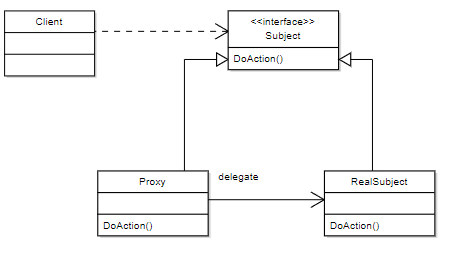

# Proxy Pattern

## 프록시

클라이언트(요청하는 객체)가 직접 서버(요청을 처리하는 객체)에 요청하는 것이 아닌 대리자를 통해 간접적으로 요청할 때 대리자를 프록시(Proxy)라고 합니다.

### 프록시 장점

직접 호출이 아닌 대리자를 통해 간접 호출시 대리자가 중간에서 여러가지 일을 할 수 있습니다.

1. 데이터 요청시 이미 캐시에 데이터가 있는 경우 서버에 요청하지 않고 캐시에 있는 데이터를 반환할 수 있습니다.(접근 제어, 캐싱)

2. 데이터 요청시 클라이언트가 기대한 것 외에 추가적인 기능을 제공할 수 있습니다.(부가 기능 추가)

3. 대리자가 또 다른 대리자를 부를 수도 있습니다. 클라이언트는 대리자를 통해 요청했는데 그 이후는 모릅니다. (프록시 체인)

### 사용방식에 따른 분류

둘다 프록시를 사용하는 방식이지만 의도에 따라 프록시 패턴과 데코레이터 패턴으로 구분합니다.

- 프록시 패턴: 접근 제어가 목적
- 데코레이터 패턴: 부가 기능 추가가 목적

## 프록시 패턴 개념

- 코드를 변경없이 프록시를 도입해서 접근 제어를 하는 패턴입니다.
- 프록시 패턴은 프록시를 사용하는 여러 패턴 중 하나일 뿐 입니다.
- 클라이언트는 프록시 객체가 주입되었는지 실제 객체가 주입되었는지 모릅니다.

## 역할

### Subject (주체)

- 실제 객체와 프록시 객체가 구현해야하는 인터페이스입니다.
- Subject 덕분에 클라이언트는 실제 객체와 프록시 객체를 구분하지 않고 사용할 수 있습니다.
- 예시에서는 `Subject` 인터페이스가 역할을 합니다.

### RealSubject (실제 주체)

- 실제 클라이언트가 사용하려고 했던 객체입니다.
- 그림에서 서버 역할을 합니다.
- 예시에서는 `RealSubject` 클래스가 역할을 합니다.

### Proxy (대리자)

- 클라이언트가 실제 객체를 사용하려고 했을 때 대신 사용하는 객체입니다.
- 만약 혼자 처리가 어려운 경우 RealSubject에게 요청을 위임합니다.
- 예시에서는 `CacheProxy` 클래스가 역할을 합니다.

