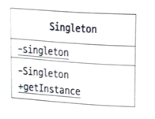

# Singleton Pattern

- 인스턴스가 하나만 존재하는 것을 보증하는 패턴을 싱글톤 패턴이라고 합니다.
- 싱글톤 패턴은 인스턴스가 하나만 존재해야 하는 경우에 사용합니다.
- 자바에서 싱글톤 패턴 구현시 생성자를 private으로 선언하여 외부에서 인스턴스를 생성하지 못하도록 합니다.

## 역할

### Singleton(싱글톤) 역할

- 싱글톤 역할은 유일한 인스턴스를 얻기 위한 static 메소드를 정의하고 이 메소드를 통해 동일한 인스턴스를 반환합니다.

## 기타

- 클래스의 static 인스턴스는 클래스가 JVM에 의해 로드되고 해당 클래스가 처음으로 사용될 때 생성됩니다. 
"사용된다"는 것은 클래스의 static 필드에 접근하거나, static 메소드를 호출하거나, 클래스의 인스턴스를 생성하는 것을 포함합니다.