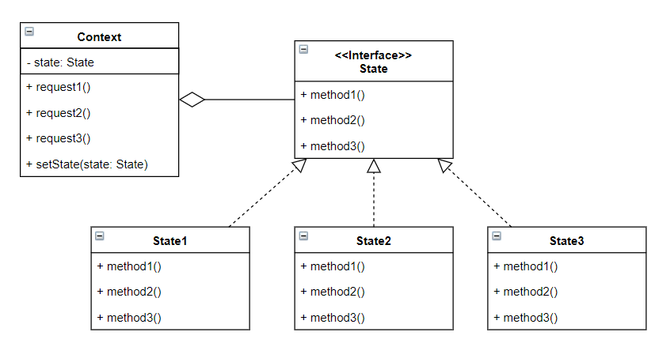

# State Pattern

- 객체의 상태 변화에 따라 객체의 행동을 변경할 수 있게 하는 패턴입니다.
- 객체의 내부 상태가 변경될 때마다 새로운 행동을 할당함으로써 객체가 자신의 클래스를 변경하는 것처럼 보이게 합니다.
- 각각의 상태를 나타내는 클래스들이 있고, 이 클래스들은 해당 상태에서 수행해야 할 행동들이 구현되어있습니다. 따라서 상태가 변경될 때마다 객체는 새로운 행동을 할당받게 됩니다.

## 역할

### State(상태) 역할

- 상태마다 다르게 동작하는 인터페이스를 정의합니다.
- 예시에서는 `State` 인터페이스가 이 역할을 합니다.

### ConcreteState(구체적인 상태) 역할

- State 역할에서 정의한 인터페이스를 구현합니다.
- 예시에서는 `DayState`, `NightState` 클래스가 이 역할을 합니다.

### Context(상황), ConcreteContext(구체적인 상황) 역할

- 현재 상태를 나타내는 ConcreteState 역할의 인스턴스를 가지고 있습니다.
- State 패턴 이용자에게 필요한 인터페이스를 정의합니다.
- 예시에서는 `Context` 인터페이스가 이 역할을 하고 구현체로 `SafeFrame` 클래스가 있습니다.

