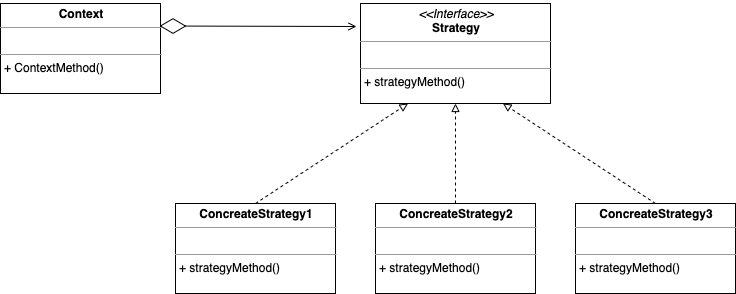

# Strategy Pattern (전략 패턴)

- 스위치를 전환하듯 알고리즘(전략, 작전, 방안)을 바꿔서 같은 문제를 다른 방법으로 해결할 수 있게 하는 패턴입니다.

## 역할

### Strategy(전략) 역할

- 전략을 이용하기 위한 인터페이스(API)를 결정합니다.
- 예시에서는 PaymentStrategy 인터페이스가 이 역할을 합니다.

### ConcreteStrategy(구체적인 전략) 역할

- 전략을 실제로 구현합니다.
- 예시에서는 KakaoPayStrategy, NaverPayStrategy 클래스가 이 역할을 합니다.

### Context(문맥) 역할

- 전략을 이용하는 역할입니다.
- 예시에서는 ShoppingCart 클래스가 이 역할을 합니다.

