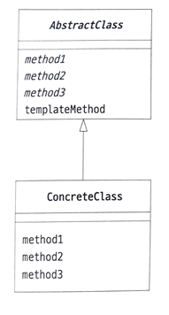

# Template Method Pattern

- 템플릿 메소드 패턴은 상위 클래스에서 처리의 뼈대를 정의하고, 하위 클래스에서 그 구체적인 내용을 결정하는 디자인 패턴입니다.
- 변하지 않는 부분을 추상클래스에 두고 변하는 부분을 하위 클래스에서 구현하도록 합니다.

## 역할

### AbstractClass(추상 클래스) 역할

- 템플릿 메소드를 구현하며 처리의 뼈대를 정의합니다.
- 예시에서는 AbstractDisplay 클래스가 이 역할을 합니다.

### ConcreteClass(구체적인 클래스) 역할

- AbstractClass 역할의 추상 메소드를 구현하여 처리의 내용을 결정합니다.
- 예시에서는 CharDisplay와 StringDisplay 클래스가 이 역할을 합니다.
- 실제 동작은 CharDisplay나 StringDisplay 클래스에서 정해집니다.



## 기타 

### 단점

템플릿 메서드 패턴은 상속을 사용하다보니 상속에서 오는 단점들을 그대로 가지고 있습니다.

- 자식 클래스에서 부모 클래스의 기능을 사용하지 않을 경우에도 부모 클래스의 기능을 상속받아야 합니다.
- 별도의 클래스나 익명 내부 클래스를 만들어야 하는 부분도 복잡합니다.

### 코드 예시

**사용 전**

```java
public class TemplateMethodTest {

    private void logic1() {
        long startTime = System.currentTimeMillis();
        
        log.info("비즈니스 로직1 실행"); // 이 부분 뺴고 나머지는 변하지 않는 부분
        
        long endTime = System.currentTimeMillis();
        long resultTime = endTime - startTime;
        log.info("resultTime={}", resultTime);
    }
}
```

**사용 후**

```java
public abstract class AbstractTemplate {
    public void execute() {
        long startTime = System.currentTimeMillis();
        
        call(); // 상속
        
        long endTime = System.currentTimeMillis();
        long resultTime = endTime - startTime;
        log.info("resultTime={}", resultTime);
    }
    
    protected abstract void call();
}

public class SubClassLogic1 extends AbstractTemplate {
    @Override
    protected void call() {
        log.info("비즈니스 로직1 실행");
    }
}
```


