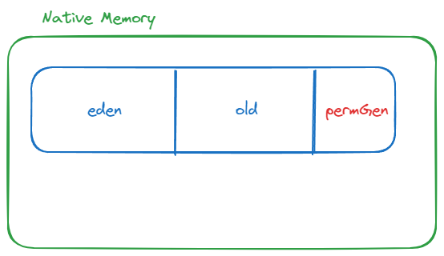
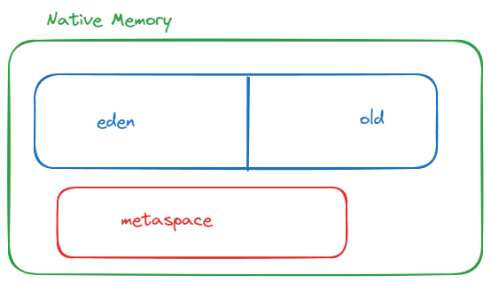

# 가비지 컬렉션

## Metaspace

JVM 힙 영역은 네이티브 메모리(OS가 제공) 내에 위치하지만, 그 구조와 관리는 JVM에 의해 독립적으로 수행됩니다. 힙 영역은 크게 Young, Old, PermGen 영역으로 나뉩니다.

### PermGen

- 클래스 메타데이터(클래스 로딩시 클래스 이름, static 필드 등)를 담아두던 메모리 공간입니다. 클래스를 많이 생성할수록 그 공간의 데이터을 많이 쓰게 됩니다.
- Heap 영역에 속합니다.

PermGen 영역은 크기가 고정되어 있어서, 클래스를 많이 생성하면 OOM(Out Of Memory)가 발생합니다.

### Metaspace 등장

JDK 1.8부터 PermGen 영역이 사라지고, Metaspace 영역이 등장했습니다.

- Metaspace 영역은 Heap 영역이 아니라, Native 메모리 영역에 속합니다.
- 초기 사이즈는 정해져있으나 최대 사이즈는 정해져있지 않습니다. (필요한 만큼 계속 늘어납니다.)
- Native 메모리를 사용하기 때문에 최대 사이즈를 정해놓고 사용하는 것이 좋습니다. (MetaSpaceSize, MaxMetaSpaceSize)

