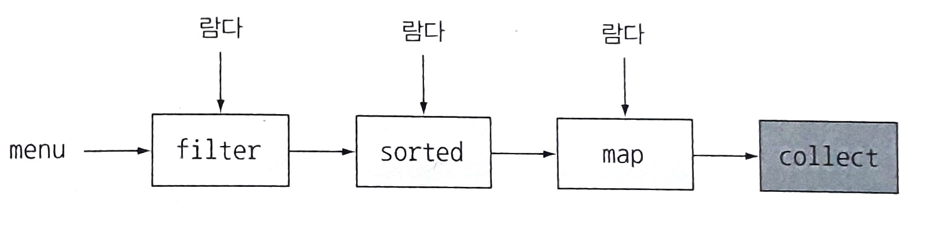

# Stream

## 개념

스트림(stream): 데이터의 흐름

스트림 API: 데이터의 흐름을 처리하는데 사용되는 파이프라인으로 연속된 데이터를 처리하는 연산들의 모임입니다.

## 특징

1. 컬렉션과 다르게 데이터를 저장하지 않습니다.
2. 원본 데이터를 변경하지 않고, 연산 결과를 새로운 스트림에 반영함으로써 불변성을 유지합니다
3. 스트림은 컨베이어 벨트처럼 데이터를 한 번만 처리하여 효율적으로 전달합니다.
4. 손쉽게 병렬 처리할 수 있습니다.
5. 선언형으로 코드를 구현할 수 있습니다.

### 선언형 프로그래밍

- 선언형 프로그래밍은 프로그램이 수행할 **작업의 결과나 조건을 명시**하는 프로그래밍 스타일입니다.
이와 대비되는 것이 절차적 또는 명령형 프로그래밍(Imperative Programming)인데, 이는 어떻게 **작업을 수행할 것인지를 명시**하는 방식입니다.
- SQL은 선언형 프로그래밍의 대표적인 예로써 질의를 작성할 때 어떤 데이터가 필요한지만 명시하고, 데이터를 어떻게 가져올지에 대한 구체적인 방법은 명시하지 않습니다.

```java
/**
 * 명령형 프로그래밍
 */
List<Dish> lowCaloricDishes = new ArrayList<>();
// 요소 필터링
for(Dish d: menu) {
    if(d.getCalories() < 400) {
        lowCaloricDishes.add(d);
    }
}
// 정렬
Collections.sort(lowCaloricDishes, new Comparator<Dish>() {
    public int compare(Dish d1, Dish d2) {
        return Integer.compare(d1.getCalories(), d2.getCalories());
    }
});
// 요리 이름 추출
List<String> lowCaloricDishesName = new ArrayList<>();
for(Dish d: lowCaloricDishes) {
    lowCaloricDishesName.add(d.getName());
}
```

```java
/**
 * 선언형 프로그래밍
 */
List<String> lowCaloricDishesName = menu.stream()
    .filter(d -> d.getCalories() < 400)
    .sorted(comparing(Dish::getCalories))
    .map(Dish::getName)
    .collect(toList());
```

## 구성

0개 이상의 중개 연산과 하나의 종료 연산으로 구성됩니다.

### 생성

- 데이터 소스에서 스트림으로 변환하는 단계
- 컬렉션, 배열, 숫자 범위, 일련의 값들, 파일 등으로 부터 스트림을 생성 할 수 있습니다.

### 중개 연산

- 여러 중개 연산들이 서로 연결되어 파이프라인을 구성하는 단계
- 중개 연산들은 새로운 스트림을 반환하기 때문에 서로 연결될 수 있습니다.
- fitler, map, limit, sorted 등이 있습니다.
- Lazy evaluation 으로 최종 연산을 수행하기 전까지는 어떠한 연산도 수행하지 않습니다.
- 중개 연산을 Stateless / Stateful 연산으로 구분할 수 있고 대부분은 Stateless지만 distinct나 sorted처럼 이전 소스 데이터를 참조해야 하는 연산은 Stateful 연산입니다.
 
### Lazy evaluation을 활용한 연산 최적화 방법

**루프 퓨전**

서로 다른 연산을 하나의 단일 루프에서 처리하는 것처럼 병합하는 기법입니다.

**쇼트 서킷**

- 결과가 확실한 경우 뒤의 연산을 수행하지 않고 결과를 반환하는 기법입니다. 
- &&연산에서 처음 표현식이 거짓이면 나머지 표현식을 평가하지 않는 것과 같습니다.

```java
dishes.stream()
    .filter(dish -> { // 루프 퓨전: filter, map
        System.out.println("filter: " + dish.getName());
        return dish.getCalories() >= 200;
    })
     .map(dish -> {
        System.out.println("map: " + dish.getName());
        return dish.getName();
     })
     .limit(2) // 쇼트 서킷
     .toList();
```

### 종료 연산

- 스트림의 요소를 소비하여 파이프라인을 실행하고 결과를 도출하는 단계
- collect, forEach, reduce, allMatch, nonMatch, findFirst, findAny 등이 있습니다. (allMatch, nonMatch, findFirst, findAny 연산은 쇼트 서킷 연산이 적용될 수 있습니다.)
- 최종 연산한 스트림은 재사용할 수 없습니다.



## 장 단점

### 장점

1. 선언형으로 코드를 구현할 수 있음
    - 간결하고 가독성 향상, 메서드 체이닝 방식으로 연산의 목적과 순서를 명확히 표현할 수 있음 
    - 변하는 요구사항에 맞춰 쉽게 대응 가능
    - 내부 반복을 사용합니다.

**내부 반복과 외부 반복**  

내부 반복과 외부 반복의 차이는 누가 반복문을 제어하는가에 있습니다. 

- 외부 반복은 개발자가 직접 컬렉션의 요소를 반복하면서 작업을 수행합니다.
- 내부 반복은 컬렉션 내부에서 어떤 작업을 수행할 것인지만 선언하면 됩니다. 

결국 내부 반복도 안에 반복문이 돌아갑니다 대신 개발자가 신경 쓸 필요가 없다는 점이 다릅니다.

2. 병렬처리가 쉬워짐

### 단점

1. 내부적으로 많은 동작과 중간연산의 Lazy evaluation 때문에 상대적으로 디버깅이 어려움

2. for loop에 비해 성능이 떨어질 수 있음(원시 타입의 경우 15배, 래퍼 클래스의 경우나 루프 내에 연산 비용이 큰 경우 큰 성능 차이를 보이지 않음)

## 병렬 처리

- parallelStream을 사용하여 데이터를 병렬로 처리하여 성능을 향상 시킬 수 있습니다. 이때 내부적으로 ForkJoinPool을 사용해 큰 작업을 작은 작업으로 분할(Fork)하고 이들을 병렬로 처리한 후 결과를 합칩(Join)니다. (parallelStream()은 SplitIterator 인터페이스를 사용하여 스트림을 쪼개서 병렬 처리합니다.)
- 병렬 Stream에서 toList()와 같이 순서를 보장하는 Collector를 사용하면 최종 결과는 원본 데이터의 순서를 유지합니다. 반면, 순서가 보장되지 않는 toSet()와 같은 Collector를 사용하면 최종 결과의 순서가 무작위가 될 수 있습니다.
- 모든 경우에 병렬 스트림이 성능을 향상시키는 것은 아닙니다. 스레드 생성 및 관리, 컨텍스트 스위칭의 오버헤드 때문에 단일 스레드 처리보다 느려질 수 있습니다. 특히, 데이터가 방대하지 않은 경우에는 병렬 처리의 이점이 크지 않습니다.
- 병렬 처리의 한계 때문에 리액티브 프로그래밍과 리액티브 스트림이 등장했습니다. 이는 비동기 처리와 스레드 사용의 효율성을 높이는 방식으로 데이터 스트림을 처리합니다.

## 리듀싱 연산

리듀싱 연산은 스트림의 여러 요소를 하나의 요약된 결과로 결합하는 과정을 의미합니다.   
이 과정은 주로 reduce와 collect 두 가지 방법으로 수행됩니다.

### reduce

- reduce는 스트림의 모든 요소를 하나의 결과로 합치는 연산을 수행합니다. 
- 숫자 리스트의 합계, 최대값 또는 최소값을 계산하는 것과 같은 작업에 자주 사용됩니다. 

### collect

- 스트림의 요소를 가변 컨테이너(예: 리스트, 맵, 집합)에 수집하는 데 사용됩니다.
- toList, toSet, joining과 같은 메서드를 통해 다양한 컬렉션 타입으로 결과를 수집할 수 있습니다.

### reduce와 collect 차이

reduce와 collect는 비슷해 보일 수 있지만, 사용 목적과 적용 방식에 차이가 있습니다. 
예를 들어, toList 같은 작업은 collect의 메서드로 구현되어 있지만, 이론적으로 reduce를 사용하여 구현할 수도 있습니다.

그러나 toList의 경우 가변 컨테이너에 요소를 수집하는 것이 목적이기 때문에 모든 요소를 하나의 결과로 합치는 것이 목적인 reduce와는 다릅니다.

그리고 reduce를 toList를 구현할 경우 각 단계에서 새로운 리스트를 만들고, 이전 단계에서 만든 리스트와 현재 요소를 결합하여 새로운 리스트를 반환하게 됩니다.

매 단계마다 새로운 리스트를 생성하므로, 특히 큰 데이터 세트에 대해서는 효율적이지 않습니다.

**결론:** reduce와 collect는 서로의 목적에 맞게 사용하는 것이 중요합니다.
